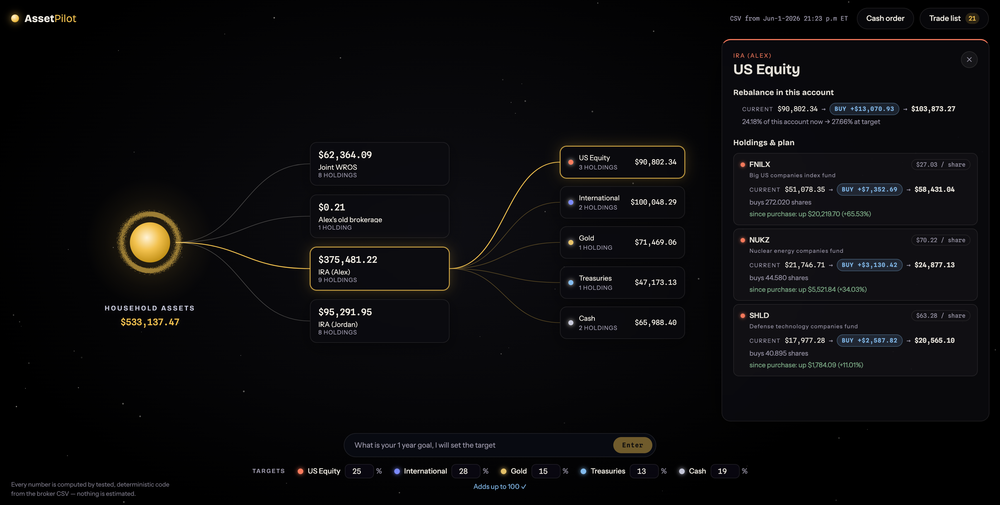
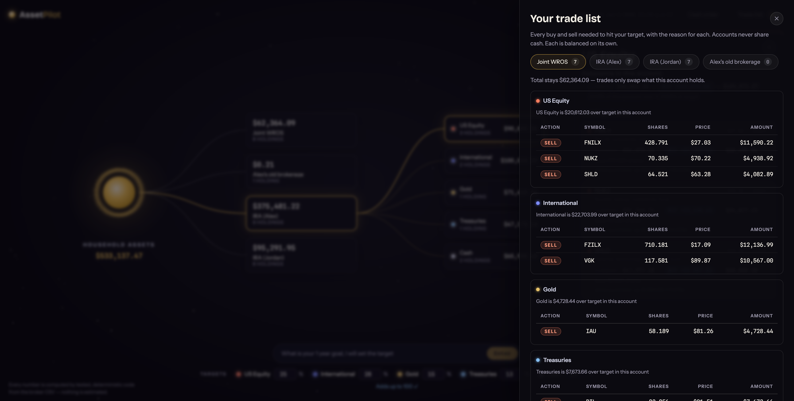

# AssetPilot

A rebalancing tool for a two-person household with four broker accounts. It
reads one broker CSV, groups every holding into five asset classes, takes an
editable target, and returns the exact buys and sells needed to reach it. Cash
never moves between accounts: each account is rebalanced on its own, funded
only by its own sells and its own cash, so no account's total ever changes.

**Live app:** https://TODO-PASTE-VERCEL-URL, deployed on Vercel
(see [Deploy](#deploy-vercel)).

Design docs: [PROBLEM.md](PROBLEM.md) · [PERSONA.md](PERSONA.md) ·
[spec](specs/001-rebalancing-tool/spec.md)

## How it works

One sentence: the CSV is parsed once into typed positions, a deterministic
engine computes every dollar figure and every trade, and the AI, which is
optional, only suggests a target shape or explains numbers the engine already
produced.

```
 broker CSV  (26 rows, 11 symbols, 4 accounts)
     │
     ▼
 parse.ts ────────▶  Position[]        cash becomes units @ exactly $1.00
     │
     ▼
 mapping.ts ──────▶  asset class       fixed table; unknown symbol = throw
     │
     ▼
 Target { 5 whole percentages, sum 100 }
     │        ▲
     │        └──── dollarTarget.ts  ◀──── "keep $300k in cash"
     ▼
 rebalance.ts
     ├─ placeCash()               walks the cash order, account by account
     ├─ planAccount()             per account only, never across accounts
     ├─ detectFractionalSupport() derived from the data, not hardcoded
     ├─ executableTrade()         whole-share rounding, always down
     └─ assertAccountBalances()   throws if off by more than $0.005
     │
     ▼
 Trade[] ─────────▶  src/ui/           draws only; no business logic
                          │
                          └──▶ api/targets.ts   AI, optional
                                                suggests + explains
                                                never computes
```

Two rules hold the whole thing together:

1. **The engine owns every number.** `src/engine/` is plain TypeScript under 53
   tests. The UI renders what it is handed and nothing more.
2. **The AI never produces a figure.** It sees no raw CSV and emits no trade.
   Remove it and the app still works completely.

## Screenshots

A quick walkthrough: open the household, set a target, and read off the trades.


The per-account detail: holdings, the planned buys and sells, and each
position's gain since purchase.



The trade list: every buy and sell to hit your target, grouped by asset class,
with each account balanced on its own.



## Run

```bash
npm install
npm test        # 53 engine tests, incl. a to-the-cent invariant check
npm run dev     # open the printed localhost URL
```

The app is fully functional with zero configuration; the AI helper is optional
(see [Deploy](#deploy-vercel)).

---

## Section A: Written analysis

### Reshaping the raw data

The CSV is a flat list: one row per holding, dollars like `"$7,673.66 "`, losses
like `($0.54)`, a `Date downloaded …` footer, and cash rows marked with `**` and
blank price and quantity. I don't trust any of that deeper in, so all parsing
happens in one place ([`parse.ts`](src/engine/parse.ts)) and everything after
works with clean, typed `Position` objects.

Two choices matter most. First, cash: a balance like `$62,364.09` becomes
`62364.09` units at exactly `$1.00`. The dollar figure never changes, but cash
now looks like any other holding, so I never special-case it later. Second,
classification: every symbol goes through one fixed table
([`mapping.ts`](src/engine/mapping.ts)), each entry justified by the CSV's own
Description column. An unknown symbol is a hard error, not a guess. I'd rather
the tool stop than drop a fund in the wrong bucket.

### Modeling the asset-class target

The target is five whole number percentages that add up to 100
([`types.ts`](src/engine/types.ts) `Target`). I kept them whole on purpose:
easier to reason about, and at this size the difference a decimal makes is
rounding dust. On open, the target is just the household's current split,
rounded to whole numbers (largest-remainder, so it still totals 100)
([`defaults.ts`](src/engine/defaults.ts)). So you open to "nothing to do," and
trades appear only once you change something.

People also think in dollars, like "keep $300k in cash." Letting the AI turn
that into a percentage came up short (it rounded down), so I moved the math
into a small tested function ([`dollarTarget.ts`](src/engine/dollarTarget.ts)).
It rounds each named class up, so you land at or just above the goal, never
under, and spreads the leftover across the classes you didn't name.

### The rebalancing algorithm

The one rule that shapes everything: cash can't move between accounts. So I
don't solve the whole household at once. I apply the target mix to each account
on its own ([`rebalance.ts`](src/engine/rebalance.ts) `planAccount`): work out
that account's dollar target per class, compare it to what it holds now, and
split the difference across the holdings in that class (or buy the class's
default fund if it holds none). Sells come before buys so the cash is there to
spend.

There's a real trade off. Driving every account to the same mix is simpler and
easy to audit, and it always funds itself, but it can mean more trades than a
solver that lets one account lean heavy so another leans light. I chose the
simpler, more predictable version. To back it up, every plan is checked to the
cent: inside each account, buys must equal sells plus the cash change, and the
total can't move. If that check fails, the engine throws instead of showing a
trade list I can't stand behind.

---

## Section B: Architecture & edge cases

### The decisions that mattered

I kept the maths and the screen completely apart. Every number comes out of
plain TypeScript with its own tests, and the screen only displays what it's
given; it decides nothing. The AI sits outside both. That means passing data
through a few extra layers, but I can test every number without opening the app.

I treat cash as just another holding: a $62,364.09 balance becomes 62,364.09
units at $1.00 each. It's not how a broker would put it, but nothing later in
the code then needs a special case for cash.

If I meet a symbol I don't recognise, I stop rather than guess. Every symbol is
looked up in one fixed table I built from the descriptions in the CSV itself.
Putting a fund in the wrong class would be worse than giving no answer.

Targets are five whole numbers adding up to 100. I lose the decimal places, but
at this size that's a few dollars, and it means you open the tool with nothing
to do, and trades only appear once you change something.

An account's total never moves. Every trade is a swap inside one account, so the
total can't change, and I check that it hasn't.

I work out which securities can be traded in fractions from the data rather than
from a list I'd have to keep up to date. If someone holds 428.791 shares, that
security clearly trades in fractions. If I only ever see whole numbers I can't
tell, so I play it safe and treat it as whole shares only.

Last, I check every plan before showing it. For each account, buys minus sells
plus the change in cash has to come to zero within half a cent, and the total
mustn't move. If either fails I stop with an error rather than show a plan I
can't stand behind.

### Where cash lives

You choose which accounts hold the household's cash and in what order. By
default the joint taxable account goes first, since that money is the easiest to
reach, then the IRAs largest first. Each account holds as much of the cash as it
can, never more than it's worth, and passes the rest down the line.

The joint account tops out at its own $62,364.09, which is 11.7% of the
household. Ask for more cash than that and the rest lands in the next account.
The $0.21 account I leave alone entirely.

### The three required edge cases

**1. An account's required buys exceed what its own cash/money-market can fund.**

This can't happen by construction. Each class target is a share of that
account's own total, so the targets add back up to exactly the money already
there. Every buy is funded by that account's own sells and cash; if it's short,
it sells more of whatever is over target. The half-cent check proves it.

**2. A position is over-weighted in the account holding it, but selling it there
pushes that account off its own target, while another account already meets that
class's target.**

I don't balance one account against another, since I can't move money between
them anyway. If a holding is too heavy where it sits, I sell it down to that
account's own target, which always moves that account closer to where it should
be. The cost is possibly more trades than a household wide solver would need.

**3. A computed trade implies buying a fractional share of a security that
doesn't support fractional trading.**

Which securities allow fractions I read from the data, as above. For anything
whole-share only, I round the buy *down* to the nearest whole share and
recalculate the dollars from that count. Down not up, so it can't overspend the
account's cash; below one share I place no trade. Leftovers stay as cash.


---

## Section C: AI usage log

Two uses. Claude Code helped me build this, and an OpenAI-compatible model runs
inside the app, turning a plain-English goal into a suggested target. I didn't
let either run unsupervised, especially near the numbers. Three moments where the
collaboration mattered. Two of them are places where I overruled it.

**1. "Let the model convert dollars into percentages" → rejected.**

Asked for "keep $300k in cash," the model produced its own percentage and rounded
56% down to 50%. Cash landed near $266k, roughly $34k under the goal, silently.
Prompt fixes were unreliable because the failure was arithmetic, not phrasing. I
moved the conversion into a tested function that always rounds the named class
*up*, so you land at or above the goal and the remainder spreads across the
classes you didn't name. The model no longer touches the number.
([`dollarTarget.ts`](src/engine/dollarTarget.ts))

**2. The self-funding invariant → accepted, then hardened.**

Claude Code proposed the check I kept: per account, buys minus sells plus the
cash change is approximately zero and the total is unchanged, throw otherwise.
Its version ran once, on one example. I put it inside a property test that runs
60 random valid targets against every cash order, seeded so failures reproduce,
so the invariant is exercised across the space rather than confirmed on a single
case.
([`assertAccountBalances`](src/engine/rebalance.ts), `rebalance.test.ts`)

**3. One flat trade table → rejected, restructured.**

The first trade list the AI built mixed every buy and sell into a single table. I
couldn't read it, and it fought the premise of the tool: the whole point is to
think in asset classes. I told it that grouping by asset type was a requirement,
not a preference, and had the list rebuilt so each account's trades sit in their
own labeled box per class (US Equity, International, Gold, Treasuries, Cash),
each box carrying the reason for that class and its own small table
([`TradesDrawer.tsx`](src/ui/TradesDrawer.tsx)). It also gave Cash its own box
showing money moving in or out rather than listing it as a trade, since cash
isn't bought or sold. That change is what made the trade list scannable.

**The line I drew:** the model may propose a shape and explain a result. It may
never produce a dollar figure, decide an asset class, or emit a trade. Those live
in `src/engine/`, under test.

---

## Deploy (Vercel)

Push the repo to Vercel; the Vite build and the `/api` function are auto-detected.
To enable the AI helper, set env vars in project settings:

| Var | Meaning |
|---|---|
| `AI_API_KEY` | key for any OpenAI-compatible provider (use a spend-capped key) |
| `AI_BASE_URL` | optional, defaults to `https://api.openai.com/v1` |
| `AI_MODEL` | optional, defaults to `gpt-4o-mini` |

The key lives only in the serverless function; it is never in the repo, the
bundle, or the browser.
